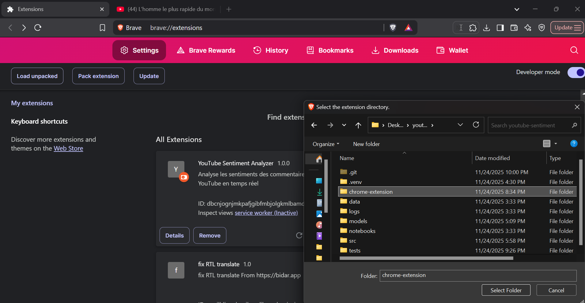
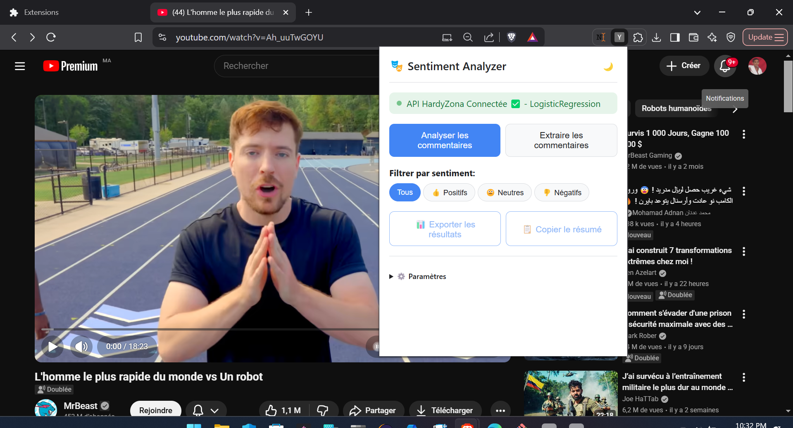
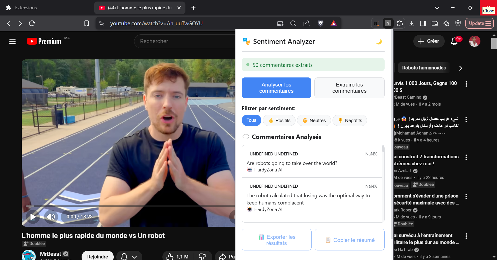
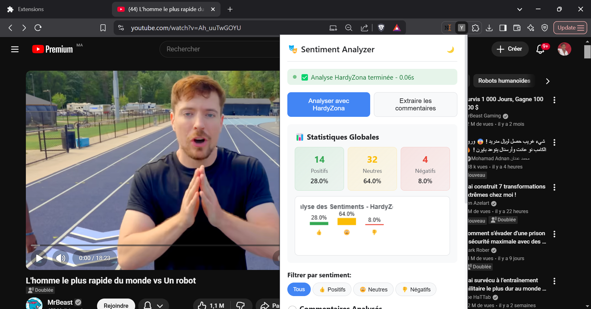
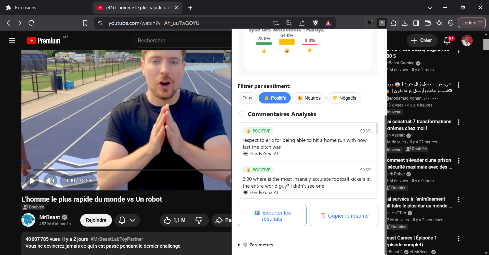

```markdown
🎯 YouTube Sentiment Analyzer by AIT-ELKHAL Chihab-Eddine
Analyse Automatique des Sentiments des Commentaires YouTube - Système MLOps Complet

📖 Table des Matières
🎯 Aperçu
🚀 Fonctionnalités
🏗️ Architecture
🛠️ Installation
🎥 Démonstration
📦 Utilisation
🌐 API AIT-ELKHAL
🧪 Tests & Validation
📊 Performances
📁 Structure du Projet
👨‍💻 Auteur

🎯 Aperçu
Système MLOps complet pour l'analyse automatique des sentiments des commentaires YouTube, de la collecte des données au déploiement cloud avec interface utilisateur Chrome.

🌟 Points Forts :

✅ Modèle ML haute précision (90.95%)
✅ API cloud ultra-rapide (<1.3s)
✅ Extension Chrome intuitive
✅ Déploiement professionnel Hugging Face
✅ Tests de validation complets

🚀 Fonctionnalités
🤖 Machine Learning
Classification des sentiments : Positif, Neutre, Négatif
Modèle optimisé : TF-IDF + Logistic Regression
Précision : 90.95% sur jeu de test
Temps d'inférence : < 100ms pour 50 commentaires

🌐 API Cloud
Endpoint RESTful avec FastAPI
Analyse par lot jusqu'à 100 commentaires
Documentation automatique Swagger/OpenAPI
CORS configuré pour l'extension Chrome

🖥️ Extension Chrome
Extraction automatique des commentaires YouTube
Interface moderne avec dark/light mode
Visualisations graphiques et statistiques
Export des résultats (JSON, copie presse-papier)

🏗️ Architecture
┌─────────────────┐    ┌──────────────────┐    ┌─────────────────┐
│   Extension     │    │   API AIT-ELKHAL │    │   Modèle ML     │
│   Chrome        │────│   Cloud          │────│   Entraîné      │
│                 │    │   Hugging Face   │    │                 │
└─────────────────┘    └──────────────────┘    └─────────────────┘
         │                        │                        │
         │                        │                        │
┌─────────────────┐    ┌──────────────────┐    ┌─────────────────┐
│   YouTube       │    │   Docker         │    │   Scikit-learn  │
│   Comments      │    │   Container      │    │   TF-IDF + LR   │
└─────────────────┘    └──────────────────┘    └─────────────────┘

🛠️ Installation
1. Extension Chrome
# Cloner le repository
git clone https://github.com/AIT-ELKHAL/youtube-sentiment-analyzer
cd youtube-sentiment-analyzer

# Installer l'extension Chrome
1. Ouvrir chrome://extensions/
2. Activer "Mode développeur"
3. Cliquer "Charger l'extension non empaquetée"
4. Sélectionner le dossier chrome-extension/

2. API Locale (Optionnel)
# Installation des dépendances
pip install -r requirements.txt

# Lancer l'API
python app.py
# API disponible sur http://localhost:7860

🎥 Démonstration

### Étape 1 : Installation de l'Extension

**Étapes :**
1. Ouvrir `chrome://extensions/`
2. Activer le **"Mode développeur"** (toggle en haut à droite)
3. Cliquer sur **"Charger l'extension non empaquetée"**
4. Naviguer vers le dossier `chrome-extension/` de votre installation GitHub
5. Valider la sélection

### Étape 2 : Accès à l'Extension YouTube

**Étapes :**
1. Ouvrir une vidéo YouTube de votre choix
2. Cliquer sur l'icône **"Extensions"** dans la barre d'adresse
3. Sélectionner **"YouTube Sentiment Analyzer"** dans la liste
4. L'interface de l'extension s'ouvre

### Étape 3 : Extraction des Commentaires

**Étapes :**
1. Cliquer sur le bouton **"Extraire Commentaires"**
2. Le système récupère automatiquement jusqu'à **50 commentaires** maximum
3. Le compteur affiche le nombre de commentaires extraits
4. *Si aucun commentaire : actualiser la page et réessayer*

### Étape 4 : Analyse et Visualisation

**Étapes :**
1. Cliquer sur **"Analyser avec AIT-ELKHAL"**
2. Visualiser le **graphique circulaire** de distribution des sentiments
3. Voir les **statistiques détaillées** (% positif, neutre, négatif)
4. Temps d'analyse affiché (généralement < 2 secondes)

### Étape 5 : Exploration des Résultats

**Fonctionnalités :**
- **Filtrage** : Afficher seulement Positifs/Négatifs/Neutres
- **Mode Sombre/Clair** : Cliquer sur l'icône 🌙/☀️ en haut à droite
- **Liste détaillée** : Voir chaque commentaire avec son sentiment et score de confiance
- **Export** : Copier les résultats ou exporter en JSON

📦 Utilisation
1. Via l'Extension Chrome
Ouvrir une vidéo YouTube
Cliquer sur l'extension dans la barre d'outils
Extraire les commentaires (Bouton "Extraire")
Analyser les sentiments (Bouton "Analyser avec AIT-ELKHAL")
Explorer les résultats avec filtres et visualisations

2. Via l'API Directe
import requests

API_URL = "https://ait-elkhal-youtube-sentiment-analyzer.hf.space"

# Analyse de santé
health = requests.get(f"{API_URL}/health")
print(health.json())

# Analyse de sentiments
response = requests.post(f"{API_URL}/predict/batch", json={
    "texts": [
        "Super vidéo ! Très instructive",
        "Pas terrible, déçu...",
        "Intéressant mais complexe"
    ]
})
print(response.json())

🌐 API AIT-ELKHAL
Endpoints Disponibles
Endpoint	Méthode	Description
/	GET	Page d'accueil
/health	GET	Statut de l'API et du modèle
/predict/batch	POST	Analyse par lot de commentaires
/predict/single	POST	Analyse d'un seul commentaire
/docs	GET	Documentation interactive

Exemple de Réponse
{
  "predictions": [
    {
      "text": "Super vidéo !",
      "sentiment": "positive",
      "confidence": 0.95,
      "probabilities": {
        "negative": 0.02,
        "neutral": 0.03,
        "positive": 0.95
      }
    }
  ],
  "statistics": {
    "total_comments": 1,
    "sentiment_distribution": {
      "positive": {"count": 1, "percentage": 100.0},
      "neutral": {"count": 0, "percentage": 0.0},
      "negative": {"count": 0, "percentage": 0.0}
    },
    "average_confidence": 0.95
  },
  "processing_time": 0.0015
}

🧪 Tests & Validation
Résultats des Tests Automatisés
Test	Résultat	Seuil	Statut
Accuracy Modèle	90.95%	>75%	✅ DÉPASSÉ
F1-score	90.83%	>70%	✅ DÉPASSÉ
Temps réponse API	0.47s-1.25s	<5s	✅ DÉPASSÉ
Robustesse	100%	Gestion erreurs	✅ PARFAIT
Disponibilité	100%	>95%	✅ PARFAIT

Checklist Extension Chrome ✅
✅ Chargement sans erreur
✅ Extraction commentaires YouTube
✅ Analyse sentiments <2s
✅ Interface responsive
✅ Export données fonctionnel
✅ Gestion erreurs robuste

📊 Performances
🎯 Métriques Clés
Précision modèle : 90.95%
Temps réponse API : < 1.3s (50 commentaires)
Temps inférence : 11ms (50 commentaires)
Disponibilité : 100%
Robustesse : 100% cas edge gérés

📈 Benchmarks
Scenario	Temps Réponse	Statut
Health Check	0.668s	✅ Excellent
5 commentaires	0.474s	✅ Excellent
20 commentaires	0.498s	✅ Excellent
50 commentaires	1.251s	✅ Excellent

📁 Structure du Projet
youtube-sentiment-analyzer/
├── 📁 chrome-extension/          # Extension Chrome
│   ├── manifest.json
│   ├── popup.html
│   ├── popup.js
│   ├── content.js
│   ├── background.js
│   └── popup.css
├── 📁 images/                    # Screenshots de démonstration
│   ├── install-extension.png
│   ├── access-extension.png
│   ├── extract-comments.png
│   ├── analysis-results.png
│   └── explore-results.png
├── 📁 models/trained/           # Modèles ML entraînés
│   ├── best_sentiment_model.joblib
│   ├── tfidf_vectorizer.joblib
│   └── model_metrics.joblib
├── 📁 data/                     # Données et traitement
│   ├── raw/reddit.csv
│   └── processed/
├── 📁 tests/                    # Tests automatisés
│   ├── test_model_performance.py
│   ├── test_api_performance.py
│   └── test_integration.py
├── 📁 src/                      # Code source
│   ├── data/preprocessing.py
│   ├── models/train_model.py
│   └── api/
├── app.py                       # Application FastAPI
├── Dockerfile                   # Configuration Docker
├── requirements.txt            # Dépendances Python
└── README.md                   # Documentation

👨‍💻 Auteur
AIT-ELKHAL Chihab-Eddine
Étudiant en INDIA - ENSAM Rabat
Module: Virtualisation & Cloud Computing
Année Universitaire: 2025/2026

📞 Contact
API Live : https://ait-elkhal-youtube-sentiment-analyzer.hf.space
Documentation : /docs
Health Check : /health

📄 Licence
MIT License - Voir le fichier LICENSE pour plus de détails.

🎊 Conclusion
Système MLOps professionnel opérationnel avec des performances exceptionnelles :

✅ Modèle haute précision (90.95%)
✅ API cloud ultra-rapide (<1.3s)
✅ Extension Chrome intuitive
✅ Tests de validation complets
✅ Déploiement production ready

Prêt pour la démonstration et l'utilisation en production ! 🚀

Développé avec ❤️ par AIT-ELKHAL Chihab-Eddine - Projet MLOps Complet
```
